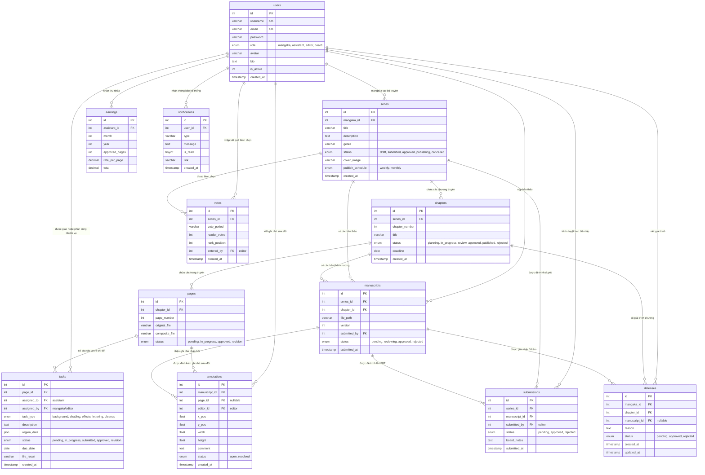

# Sơ đồ Thực thể Mối quan hệ (ERD) & Quy trình Hoạt động Cơ sở Dữ liệu

Tài liệu này mô tả chi tiết sơ đồ thực thể mối quan hệ (ERD) và giải thích quy trình hoạt động, phối hợp giữa các bảng trong cơ sở dữ liệu hệ thống quản lý xuất bản Manga (`manga_system`).

## 1. Sơ đồ Quan hệ Thực thể (ERD)

Dưới đây là sơ đồ chi tiết biểu diễn mối quan hệ giữa các bảng trong hệ thống:

---

## 2. Quy trình Hoạt động của Hệ thống (Workflow)

Hệ thống hoạt động theo một quy trình khép kín từ lúc lập kế hoạch truyện cho đến khi xuất bản và thống kê hiệu quả:

### Bước 1: Khởi tạo Bộ truyện & Lập Kế hoạch Chương (`users` ➔ `series` ➔ `chapters`)
1. **Mangaka** (`users` có `role = 'mangaka'`) tạo một bộ truyện mới trong bảng `series` (ban đầu ở trạng thái `status = 'draft'`).
2. Khi bộ truyện được duyệt thông qua, Mangaka lên kế hoạch viết các chương tiếp theo trong bảng `chapters` với trạng thái ban đầu là `'planning'` hoặc `'in_progress'`.

### Bước 2: Vẽ truyện & Giao việc cho Trợ lý (`chapters` ➔ `pages` ➔ `tasks` ➔ `earnings`)
1. Mỗi chương truyện sẽ gồm nhiều trang truyện (`pages`).
2. Mangaka tải lên các trang phác thảo (`original_file`) và tạo các nhiệm vụ vẽ chi tiết (`tasks`) cho từng vùng trên trang phác thảo đó.
3. Nhiệm vụ được giao cho **Trợ lý** (`users` có `role = 'assistant'`). Trợ lý thực hiện công việc (ví dụ: vẽ nền, đổ bóng, làm sạch nét) và tải lên file kết quả (`file_result`).
4. Khi Mangaka phê duyệt nhiệm vụ (`tasks.status = 'approved'`), thông tin này sẽ là cơ sở để tính toán thu nhập hàng tháng cho trợ lý trong bảng `earnings`.
5. Trang truyện sau khi hoàn thành các nhiệm vụ sẽ được tổng hợp thành bản vẽ hoàn chỉnh (`composite_file`) và chuyển sang trạng thái duyệt.

### Bước 3: Nộp Bản thảo & Biên tập viên Phản hồi (`pages` ➔ `manuscripts` ➔ `annotations`)
1. Khi tất cả các trang của chương sẵn sàng, Mangaka xuất ra bản thảo hoàn chỉnh (định dạng PDF/ZIP) và tải lên bảng `manuscripts` với trạng thái `'pending'`.
2. **Biên tập viên** (`users` có `role = 'editor'`) tiến hành xem xét bản thảo này:
   - Nếu có lỗi hoặc điểm cần chỉnh sửa, Biên tập viên sẽ tạo các ghi chú đánh dấu (`annotations`) tọa độ cụ thể (`x_pos`, `y_pos`, `width`, `height`) trực tiếp trên trang truyện lỗi.
   - Trạng thái bản thảo chuyển thành `'rejected'` hoặc yêu cầu sửa đổi (`chapters.status = 'review'`).
3. Mangaka nhận thông báo (`notifications`), tiến hành sửa đổi cùng trợ lý và nộp lên một phiên bản (`version`) bản thảo mới.

### Bước 4: Giải trình & Đệ trình Ban biên tập (`manuscripts` ➔ `defenses` ➔ `submissions`)
1. Trong trường hợp bản thảo bị từ chối hoặc trễ hạn nhưng Mangaka có lý do chính đáng hoặc muốn thuyết minh ý đồ nghệ thuật, Mangaka có thể gửi một bản giải trình trong bảng `defenses`.
2. Nếu Biên tập viên đồng ý thông qua bản thảo, họ sẽ đệ trình bản thảo đó lên **Ban biên tập** (Board) xét duyệt in ấn bằng cách tạo bản ghi trong bảng `submissions`.
3. **Đại diện Ban biên tập** (`users` có `role = 'board'`) xem xét và đưa ra quyết định cuối cùng (`submissions.status` chuyển thành `'approved'` hoặc `'rejected'`).

### Bước 5: Xuất bản & Đánh giá Độc giả (`submissions` ➔ `chapters` / `series` ➔ `votes`)
1. Khi Ban biên tập phê duyệt (`submissions.status = 'approved'`), chương truyện được cập nhật trạng thái xuất bản (`chapters.status = 'published'`).
2. Sau khi truyện ra mắt độc giả, định định kỳ hàng tuần/tháng, Biên tập viên sẽ nhập số liệu bình chọn của độc giả vào bảng `votes` để đánh giá thứ hạng (`rank_position`) và mức độ yêu thích của bộ truyện đó. Điều này giúp đưa ra quyết định tiếp tục phát triển hay hủy bỏ bộ truyện (`series.status = 'cancelled'`).

---

## 3. Các Luồng Liên thông Khác
- **Thông báo (`notifications`)**: Hệ thống tự động tạo thông báo khi có các sự kiện phát sinh như: phân công task mới, yêu cầu chỉnh sửa bản thảo, gửi giải trình, hoặc duyệt xuất bản.
- **Tính toán Thu nhập (`earnings`)**: Dựa trên số trang đã duyệt (`approved_pages`) của trợ lý trong tháng để tổng hợp tiền lương cuối kỳ.
